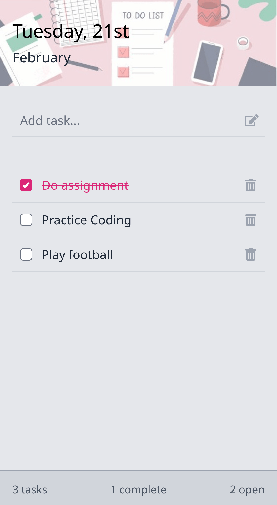

<h1 align="center">
  React To-Do App
</h1>

  
A to-do list application made with React.

  

- - -

## Table of Contents

- [Table of Contents](#table-of-contents)
- [Overview](#overview)
- [Getting Started](#getting-started)
- [Building](#building)
- [Testing](#testing)
- [Usage](#usage)
- [License](#license)

- - -

## Overview

A simple to-do list application to demonstrate my React knowledge.

Front-end project only, no backend or database storage.

## Getting Started

1. Clone the repository and `cd` into its root directory
2. Run `yarn install` to install dependencies
3. Run `yarn start` from the project directory to run in development mode

The application is served at [http://localhost:3000](http://localhost:3000) by default.

## Building

Run `yarn build` to build the static assets for external or local hosting. The files will be located inside the `build` folder by default.

This correctly bundles React in production mode and optimizes the build for best performance.

## Testing

1. Run `yarn start` to run in development mode
2. Run `yarn cypress:run` to run end-to-end tests

## Usage

Write task descriptions in the text field and press `Enter` to add them to the list. You can also click on the icon inside the text field to add the task.

Tasks can be marked as complete by ticking the checkbox. They can also be deleted by clicking the trash icon.

**Note:** Tasks are not stored anywhere. If the page is refreshed or closed, all tasks will be gone.
